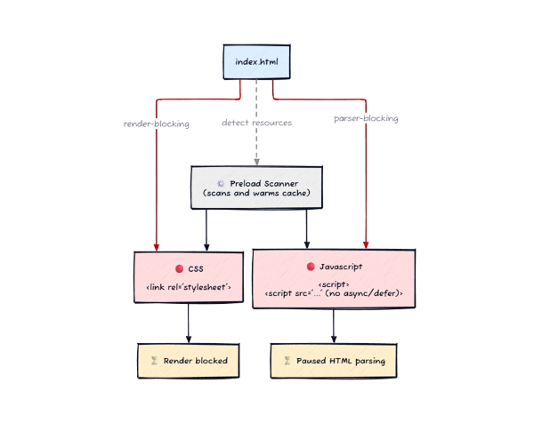

Tổng hợp Render, parser, detect resources

## Render blocking:

- Chặn trình duyệt render nguyên nhân là do thực thi file CSS ở các thẻ link

- Và có trường hợp khi CSS file chưa tải xong thì FOUC có thể xảy ra, có nghĩa là chỉ hiện basic DOM HTML

## Parser blocking:

- Chặn trình duyệt xây dựng cây DOM - HTML chạy thực thi các script

## Preload scanner 

- Là 1 cơ chế chạy ngầm quét toàn bộ html để tìm ra các liên kết quan trong để tải đồng thời luôn.

## Giải đáp - và lời khuyên

###  Vì sao nên dặt thẻ link ở head ? Đặt thẻ script ở cuối thẻ body ?
- Nên đặt link style càng trên cùng càng tốt để xây dựng các cây CSS DOM nhanh chóng. từ đó tạo ra render tree nhanh chóng

- Nhớ rằng trình duyệt đọc cây DOM từ trên xuống dưới. 