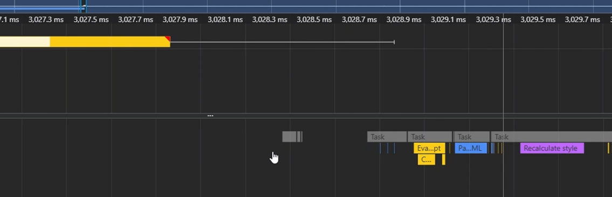

# Parse blocking
> Khi khởi tạo cây dom HTML, có những phần logic cần xử lý JS và việc xử lý JS ảnh hưởng tới cây DOM. => thẻ script JS ảnh  hưởng tới quá trình tạo cây DOM (parse HTML)

 VD1: Ta tiến hành tạo 1 file script.js timeout 3s. Sau đó paste link file này vào dòng 8 index.html

Theo dõi performance của browser

- JS cần mất 3s để compile. 
- Thanh màu xanh dương là thời gian để parse HTML từ dòng 0...6 => 1...7 trong file HTML.

Sau khi tải xong 3.02s, tiếp tục parse HTML từ dòng số 9.. đến hết

**Kết luận**: Script file ảnh hưởng tới quá trình gen ra cây DOM HTML

VD2: Lần này ta tạo 2 script link và style link. Trường hợp script file delay timeout 3s, như ở ví dụ 1 thì cây DOM HTML sẽ gen ra chậm hơn. Vậy quá trình tạo **Render tree** có bị ảnh hưởng không, và ảnh hưởng ra sao?

Theo dõi quá trình performance:

Ta thấy 2 file css và JS generate song song. 

Ở ví dụ này cho thấy file  CSS khi tải xong 1.03s thì khởi tạo liền 1 CSSDOM 

Trong khi đó JS vẫn tiếp tục download hết 3.02s.

Khi thực thi xong Script thì mới tiếp tục parse HTML còn lại

**Kết luận:** Sau khi load script xong, thì quá trình tạo ra render tree mới xảy ra.