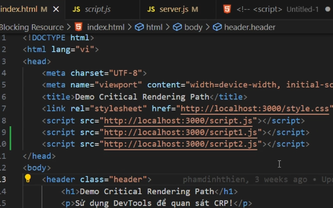
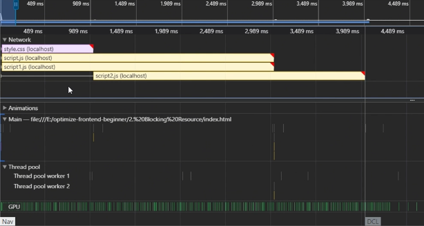

# Preload scanner
Đây là cơ chế cho phép tải nhiều script hoặc css file cùng một lúc, chạy trên nhiều thread task
> Phụ thuộc vào protocol, ví dụ HTTP: thì chỉ limit tầm 6 request thôi.
> Nếu dùng HTTP/2 thì số request tăng lên 20 request,..

-> Nhờ cơ chế preload scanner này nó sẽ tải cùng lúc 3 file script

