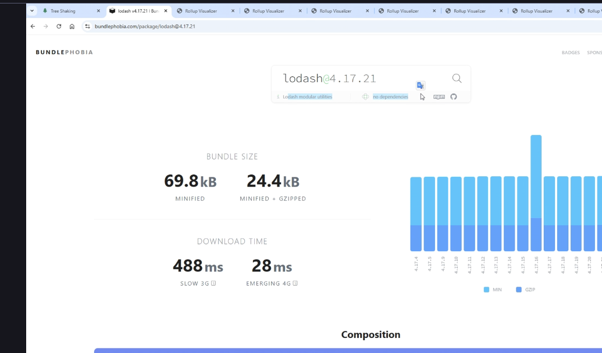

Quy trình tối ưu dung lượng resource nên theo thứ tự từ trái sang phải

# 1. Code split

> Ở phần code split mình sẽ ưu tiên tối ưu 2 phần đó là router và component

### Đối với router

> Split ở phần router có nghĩa là khi truy cập vào trang chỉ cần tải đúng tài nguyên của trang đó. React có thể dùng Lazy và Supense.


### Đối với component

> Dùng dynamic import cho từng component không dùng đến.
> 


-> Nhìn vào phần Network để xem sự thay đổi. Ở ảnh thì khi vào trang product thì chỉ call get ra page product thôi. Không hiển thị modal. Khi bấm vào từng product thì mới show modal

# 2. Tree shaking

> Loại bổ cái func không sử dụng, giảm dung lượng size của file
> 

### Cách áp dụng tree shaking cho function

Trong trường hợp tự viết các function nên lưu ý:

- Không nên dùng export default vì khi bundle lấy ra hết toàn bộ các function được export -> dân đến khi dùng import 1 function thì lại bundle ra những func khác không dùng tới.

- Nên dùng: export từng func, hoặc dùng export { funca, funcb,...}

- Có thể dùng export default khi khai báo export 1 class

### Cách áp dụng tree shaking trong việc sử dụng các thư viện bên ngoài

- Cần xác định xem thư viện đó có hỗ trợ tree shaking hay là không.

Ví du: Tôi import 1 func cloneDeep từ lodash. 2 cách gọi import từ lodash gây ra bad size. Điều này rất tệ vì chỉ dùng 1 func cloneDeep(). Nhưng import toàn bộ func lodash dẫn tới khi bundle size rất lớn.


Cách sử dụng đúng -> from tới đúng func cloneDeep


kết quả bundle size gỉảm 5/6


Để biết thư viện nào có hỗ trợ treeShaking vào link https://bundlephobia.com

Đối với các thư viện không hỗ trợ treeShaking thì cần gọi import tới đúng link func cần sử dụng.

# 3 Minify và Compress

> Minify là kỹ thuật chuyển tên func kí tự dài thành ngắn,khoảng trắng, kí tự thừa, rút gọn tên biến hàm, xóa các comment, console.log,..


## Áp dụng minify thủ công

> Truy cập các trang web có hỗ trợ minify và tiến hành dán file cần minify


## Áp dụng minify đối với các tool build

Ví dụ: Ở đây sử dụng Vite để minify

Loại bỏ console.log


Minify loại bỏ khoảng trắng, rút gọn tên biến, tên hàm,..


## Áp dụng Compress

> Đây là kỹ thuật giúp tối ưu dung lượng tối đa. 
- Có 2 cách compress: gzip và brotli

Đối với backend có thể sử dụng thư viện compression

```cmd
    npm i compression
```

Tối ưu Gzip với Nginx
> Nén Gzip ở phía nginx


### So sánh brotli vs gzip
> Brotli sử dụng hiệu quả hơn gzip. 