# Lazy loading

> View port -> những cái người dùng quan sát được trên màn hình. Những phần không quan sát được cần scroll xuống thì gọi là Below the fold
> 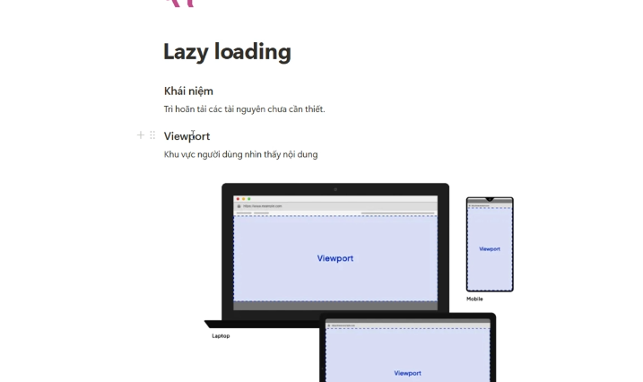
> 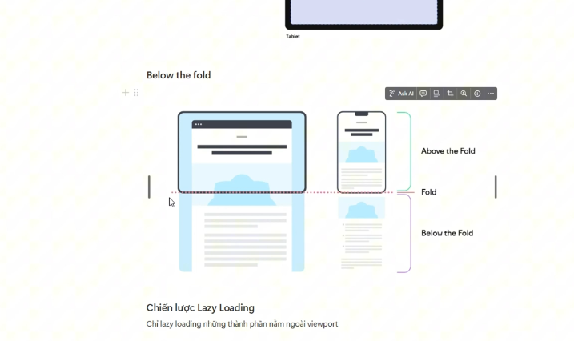

### Lazy loading Image

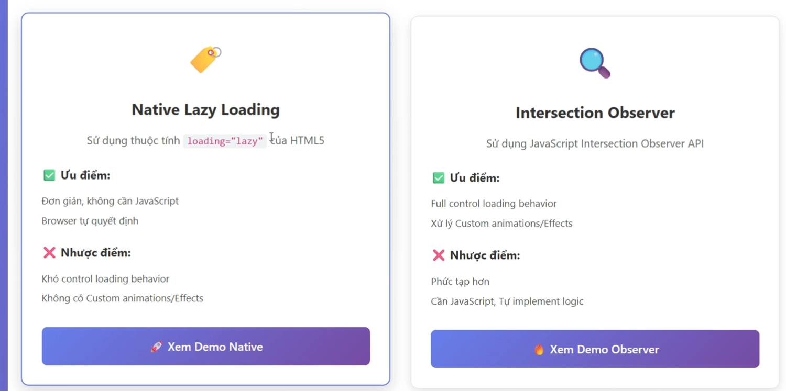
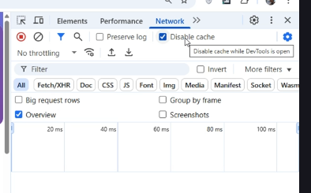

- Để quan sát được lazing loading cho Image - cần disable cache
- Có 2 cách để lazy cho Img.

#### Cách đơn giản nhất là thêm attribute lazy.

Nhưng nhược điểm là điều này khiến cho coder không kiểm soát được bao nhiêu ảnh sẽ lazy, mà quyền quyết định đó nằm ở browser.

#### Cách 2 Intersection Observer

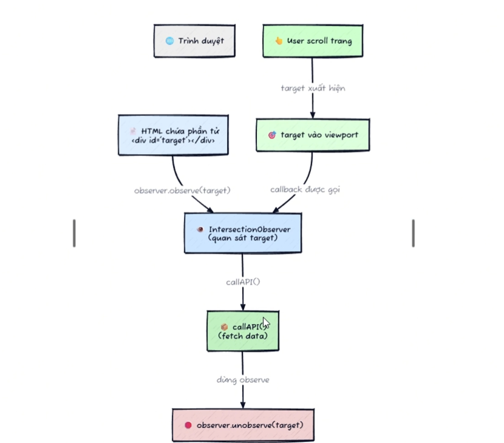
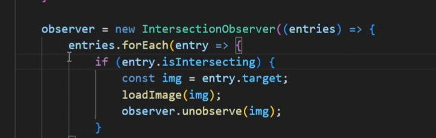
Khởi tạo init một observer

- với tham số threshold = 1 -> nghĩa là khi viewport chứa 100% element đó thì mới bắt đầu thực hiện observer func
- rootMargin: 50px -> tăng giảm viewport linh động
  [Tham khảo thêm demo](https://blog.webdevsimplified.com/2022-01/intersection-observer/)

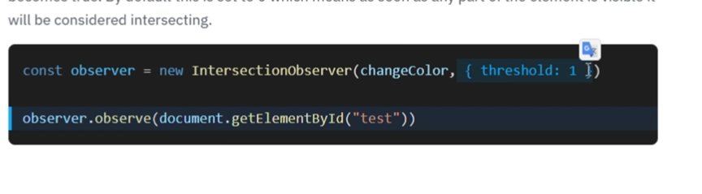
Cài đặt package

```cmd
npm i intersection-observer
```

# Async + defer

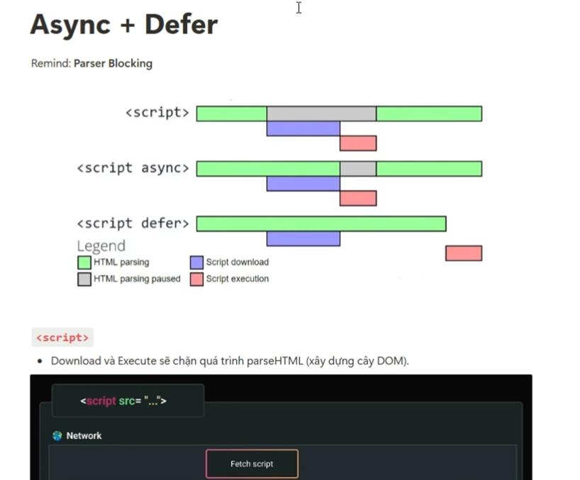

Script khi không dùng async, browser sẽ đọc sync các file gây ra parse blocking -> chậm tóc độ tải trang
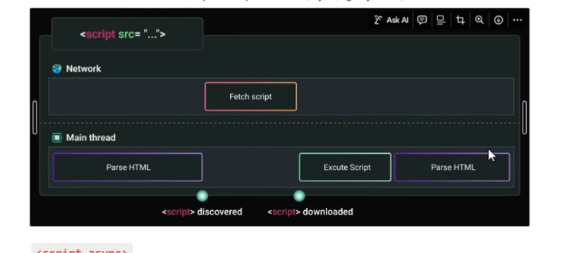

Để khắc phục việc này, allow async cho script bằng cách thêm attribute async
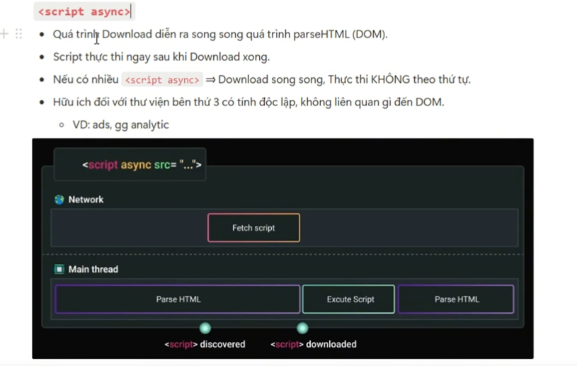

Dùng script defer. Cho phép chạy song song việc Parse HTML và Fetch script. Sau khi parse thành công thì Execute script. Điều này tương tự như khai báo script ở cuối body.
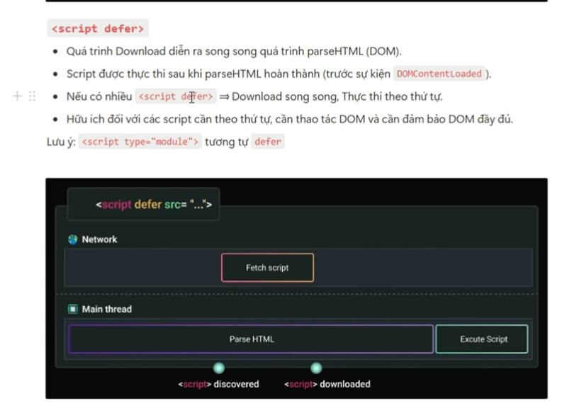
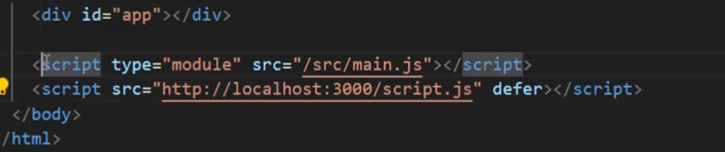

> Kết luận: async có thể gây ra parse blocking vì khi fetch xong thì async sẽ execute ngay script còn đối với defer thì không. Khi parse HTML xong mới đến execute script1,script2,script3 theo thứ tự trên xuống. **Nên lưu ý LUÔN LUÔN sắp xếp script thông minh nếu dùng defer. Còn async thì không**

# Preload + Prefetch

### Preload

> Chế độ này ưu tiên tải trước tài nguyên cần thiết cho **HIỆN TẠI** để tránh làm chậm quá trình parse HTML.
> 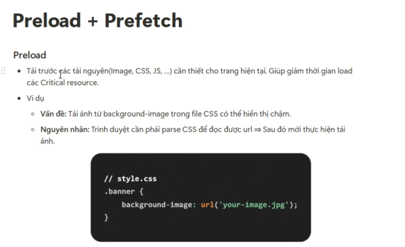
> Ở đây khi nhìn vào waterfall tải xuống từ trình duyệt cho thấy hình bên trái không sử dụng preload, tài nguyên tải SYNC. Gây ra tốn thời gian. Cách khắc phục là trong khi tải các tài nguyên HTML, có thể tải song song cái tài nguyên cần thiết trước ví dụ như là ảnh
> 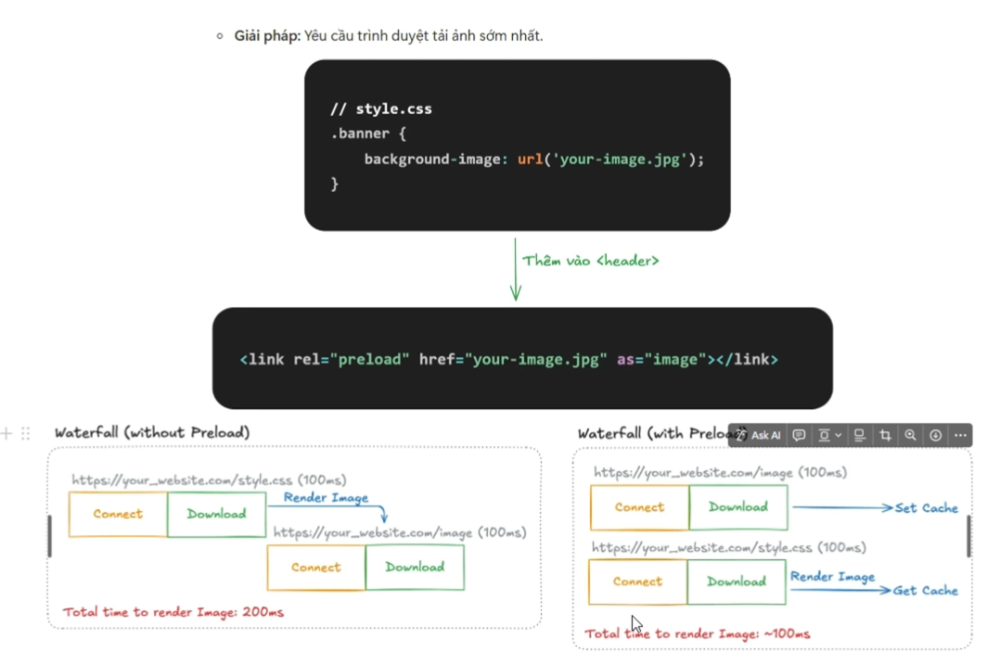
> 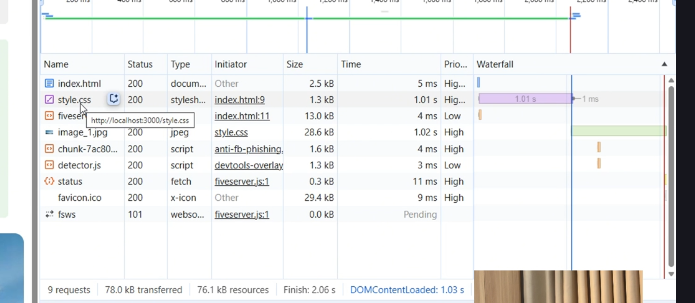

Lưu ý: Cần xác định những thành phần cần để ưu tiên Preload. => Dự đoán được những dữ liệu nào nên được tải trước

### Prefetch

> Prefetch là chế độ tải những dữ liệu có thể dùng trong **TƯƠNG LAI**

Ví dụ: Khi bấm nút toggle Image, browser render ra tài nguyên mới là 1 hình ảnh thứ 2. Vậy khi bấm vào sẽ mất 2s để tải tài nguyên này
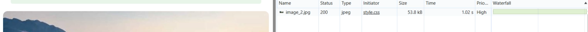
Nếu biết trước user sẽ có hành vi toggle Image, vậy thì ưu tiên prefetch Image thứ 2 trước. Để browser cache sẵn tài nguyên. Khi bấm toggle chỉ cần show image
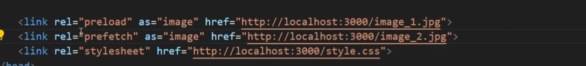

Kết quả chỉ mất 4ms
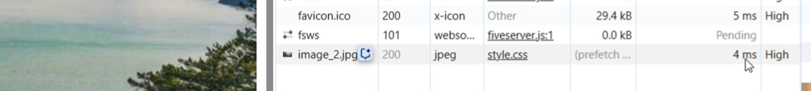

# Preconnect và DNS-Prefetch

> Việc connect tới các bên thứ 3 cũng mất nhiều thời gian. Để cải thiện tốc độ tải dữ liệu từ các domain service này nên dùng cơ chế pre connect và dns prefetch. Giúp tải trước hoặc DNS một số domain cần connect
> 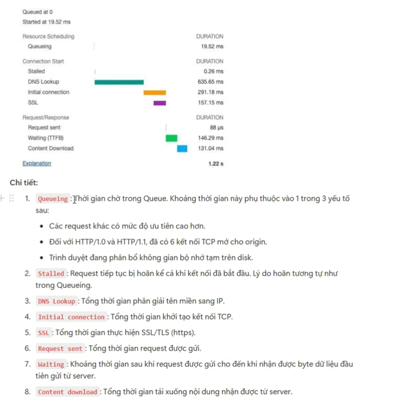

### Sử dụng preconnect

- Sử dụng preconnect để thiết lập connect tới các domain cần gọi api như gg ads, cloudinary,... Lưu ý không lạm dụng cho quá nhiều domain services vì điều đó gây ra tắc nghẽn tài nguyên, thường chỉ nên sử dụng 3-4 domain
  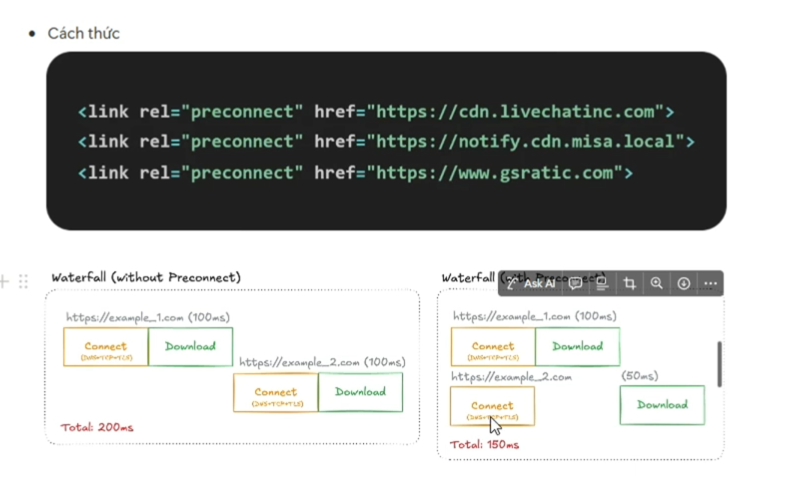

- DNS prefetch là việc phân giải tên miền DNS. Có thể áp dụng nhiều domain hơn 4-5 domain vì phân giải có thể tốn ít thời gian hơn preconnect
  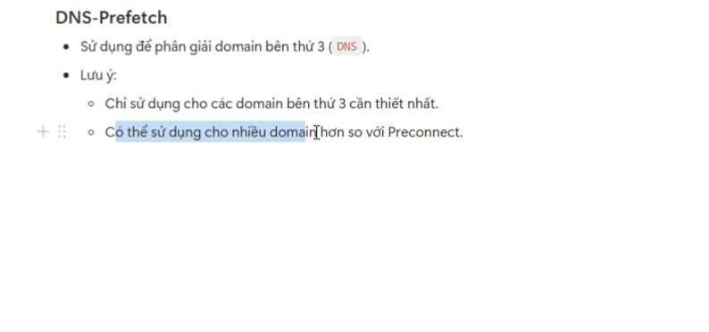

# Critical và Non-Critical

> Kỹ thuật tách file

Giảm dung lượng cho critical tải file nhanh hơn và trình duyệt render nhanh hơn.
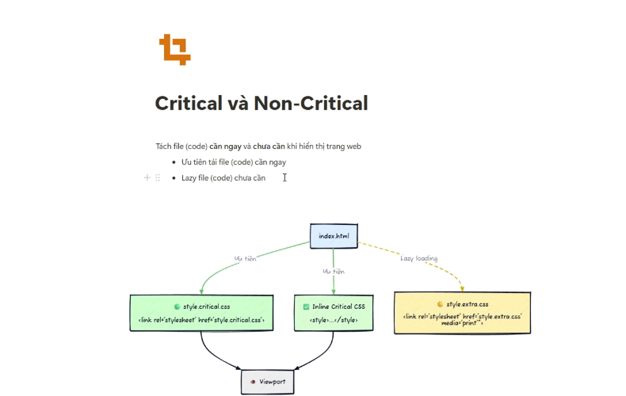
Cách khác là viết script để thực thi load file, khi window onload thì thực thi crititcal file trước sau đó tới none-critical sau, ngoài ra kỹ thuật này còn có thể áp dụng được cho Script file 
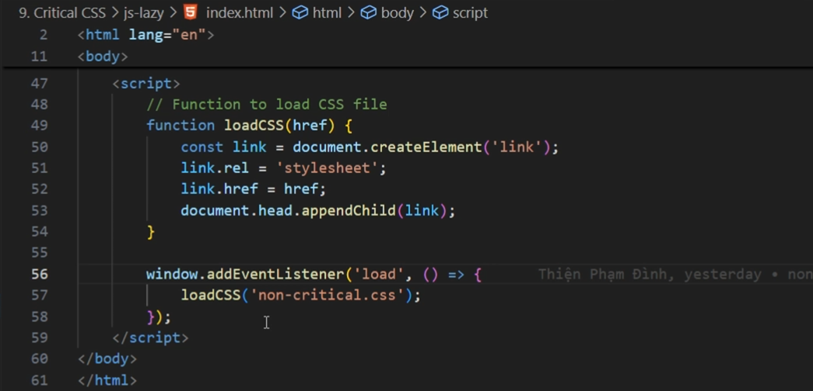
Kết quả cho thấy độ ưu tiên vẫn highest nhưng trick này vẫn tải non-critical sau

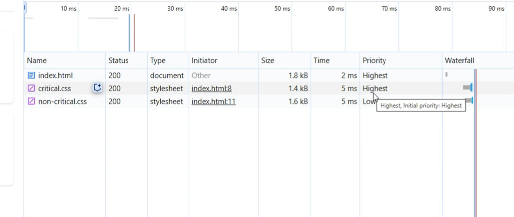
Một số trick khác, có thể dùng style-inline:

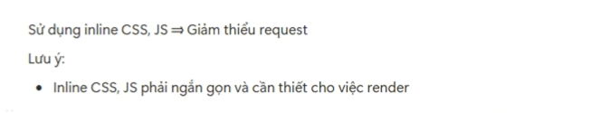

