# EventLoop
>Event loop là một cơ chế giúp cho Javascript sử lý single thread như một vòng lặp vô tận để ASYNC
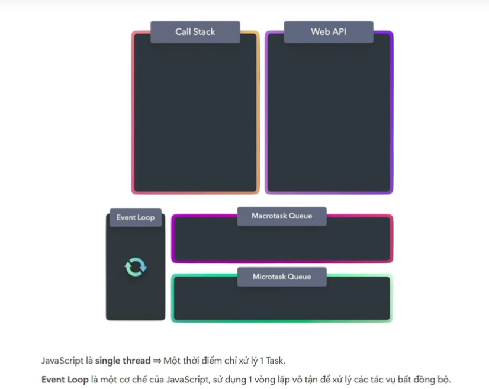
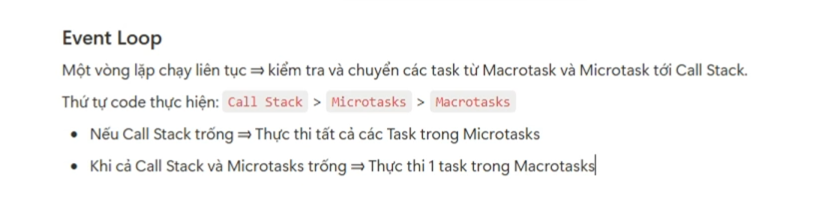

# Web api
> Web api là các func do JS ECMA cung cấp để thực thi calling các function. Có 2 loại function là callback-based và promise based. 

- Callback-based  -> Macro task
- Promise-base  -> Micro task

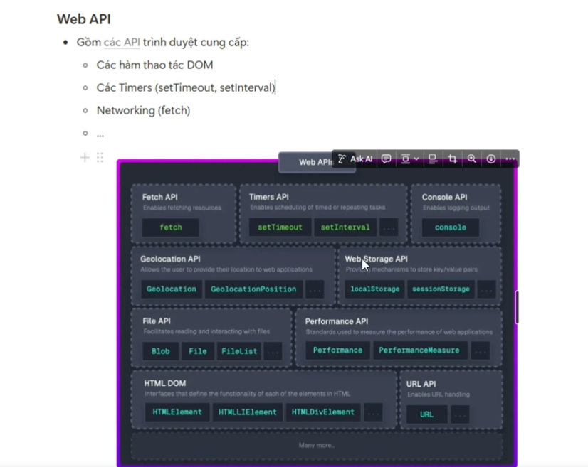
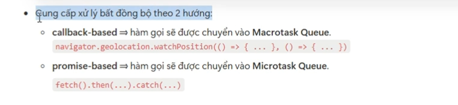
# MicroTask & MacroTask

Thứ tự thực của event loop
```

Base function
    |
Micro task ( fetch, calling api, read file,...)
    |
Macro task ( setTimeOut, setInterval...)
    |
  Output
```
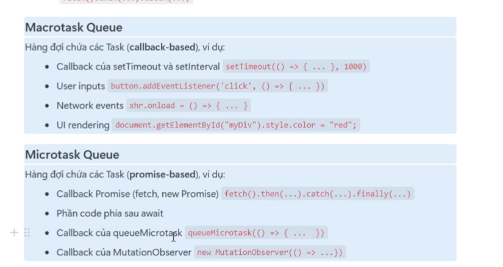

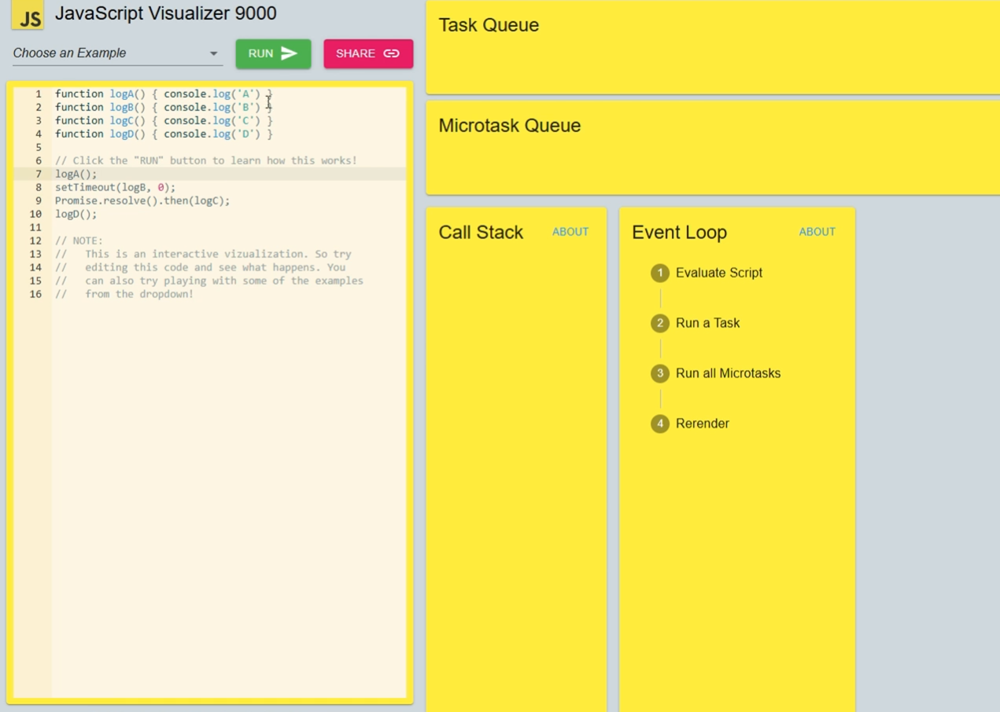

# Tối ưu Long Task
> Đây là skill khó và yêu cầu hiểu rõ về Eventloop nên mình sẽ ghi chi tiết hơn.

Bối cảnh đưa ra, khi thực những long task ( long task những task có thời gian thực thi > 500ms) gây ảnh hưởng tới việc render tree. Có thể gây ra tình trạng render blocking.
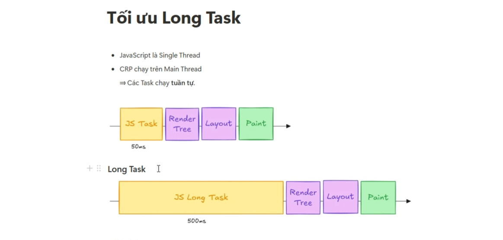

### Split long task

Từ bối cảnh đó, solution để giải quyết là tách long task thành multi task nhỏ hơn bằng cách ứng dụng macrotask.
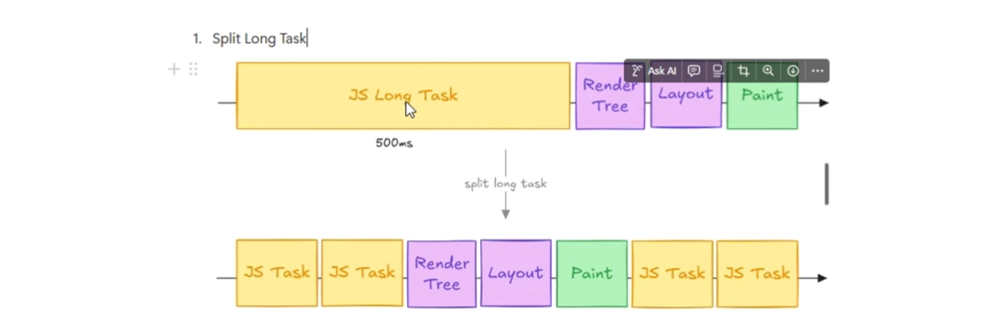

Ex: Để ví dụ bây giờ tạo 1 mảng duyệt qua 50K phần tử
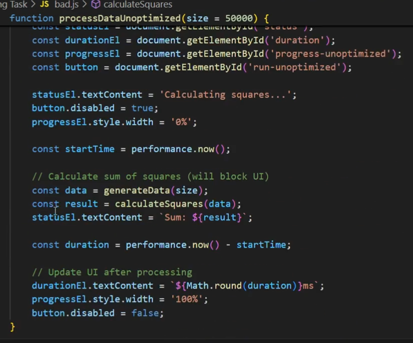
Sau khi thực thi việc duyệt 50K phần tử, thấy mất 6s
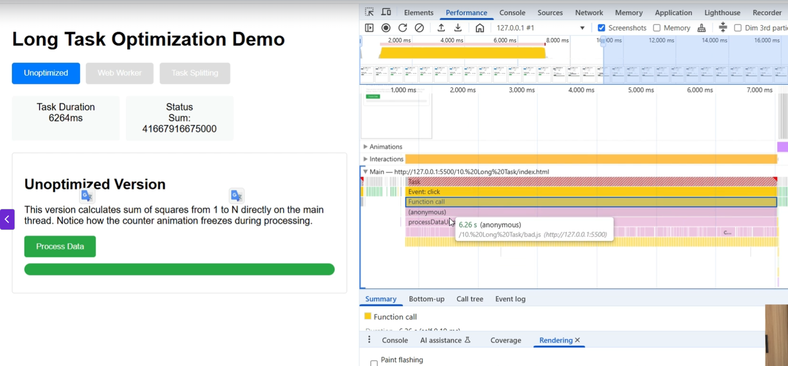
Xuất hiện bug không thể select to text được, bởi vì khi này Long task đang chiếm hết thread -> gây ra tình trạng render blocking.

Bắt đầu tối ưu bằng cách ứng dụng split
> Bản chất chia task ra nhiều chunk nhỏ, mỗi chunk xử lý 100 phần tử. Bỏ vào setTimeOut để những callBack này tạo thành macroTask queue
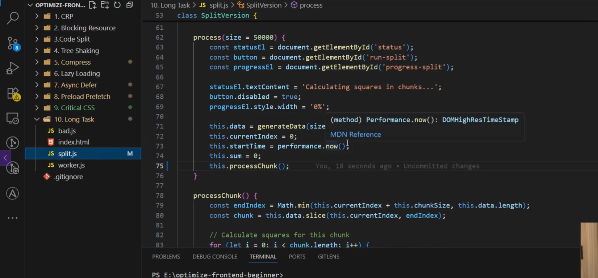

Kết quả vẫn select to text ổn 

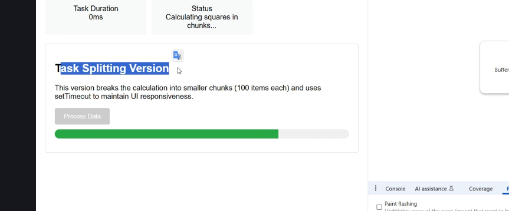

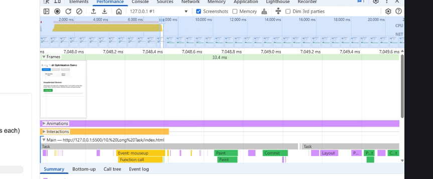


### Sử dụng web worker
> Web worker cho phép task được chạy trên nhiều thread khác nhau. Giảm thiểu việc blog main thread. Web worker chỉ xử lý tính toán và trả kết quả về cho main thread không tương tác được với DOM. DOM chỉ dành cho main thread

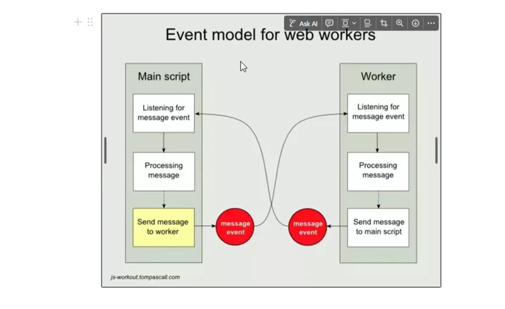