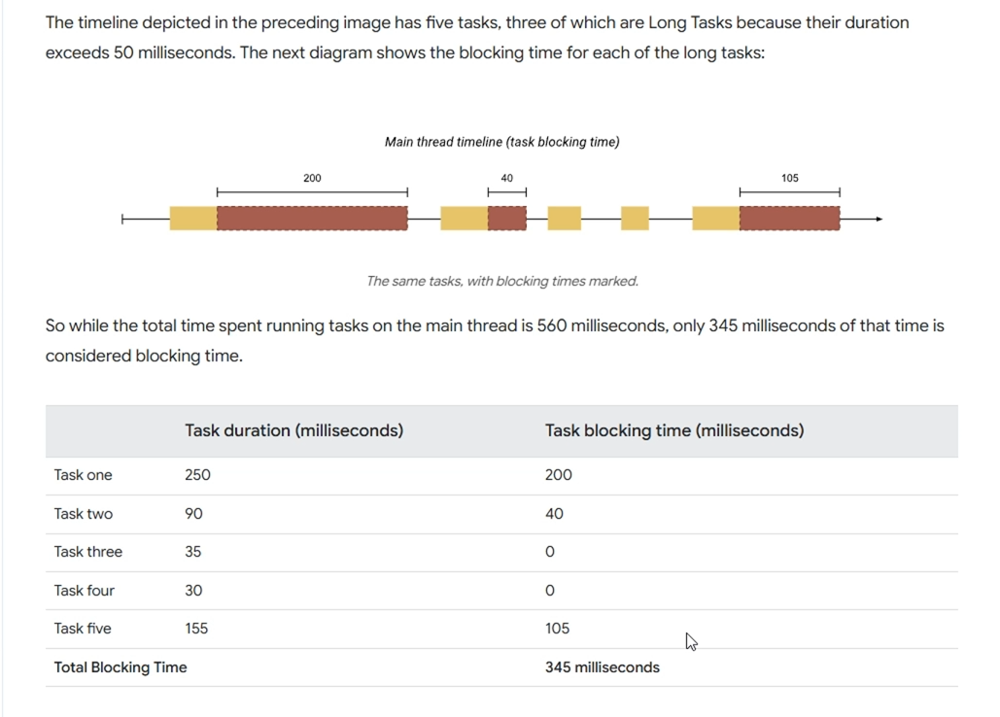

# Lighthouse 
> Đưa ra những guideline, bản report để cải thiện hiệu suất của website. 

# First contentful paint
Cho biết khoảng thời gian phần tử đầu tiên được loading: image, text,...

# Largest contentful paint
Thời gian render nội dung lớn nhất của page
# Total blocking time

Những task vượt quá 50ms,tổng thời gian của những long task 
# Cumulative layout shift
Độ chuyển động của các element ~ second. Độ xê dịch tỉ lệ thuật với số phần tử element xê dịch càng lớn.
# Speed index
Ít khi quan tâm, khi tăng 4 chỉ số trên thì chỉ số này tự tốt lên. Khoảng thời gian hiển thị gần như xong các page
